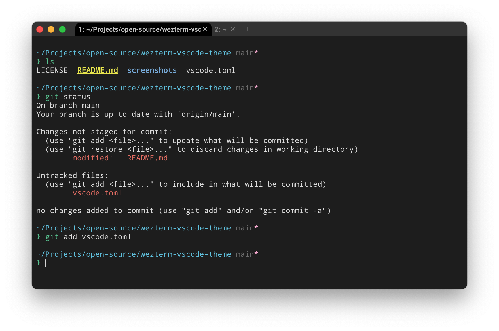

# VSCode inspired theme for [WezTerm](https://wezfurlong.org/wezterm)

> A dark theme for [Wezterm](https://wezfurlong.org/wezterm).



## Installation

Create the `$HOME/.config/wezterm/colors` folder if it does not already exist

```bash
mkdir -p $HOME/.config/wezterm/colors
```

download the theme file into that folder

```bash
curl https://raw.githubusercontent.com/igorkulman/wezterm-vscode-theme/refs/heads/main/vscode.toml --output $HOME/.config/wezterm/colors/vscode.toml
```

activate the theme in your `.wezterm.lua` configuration file

```lua
config.color_scheme = 'vscode'
```

My recommended visual settings for using WezTerm on macOS are also


```lua
config.default_cursor_style = 'SteadyBar'
config.window_decorations = "INTEGRATED_BUTTONS|RESIZE"
```

## License

[MIT License](./LICENSE)